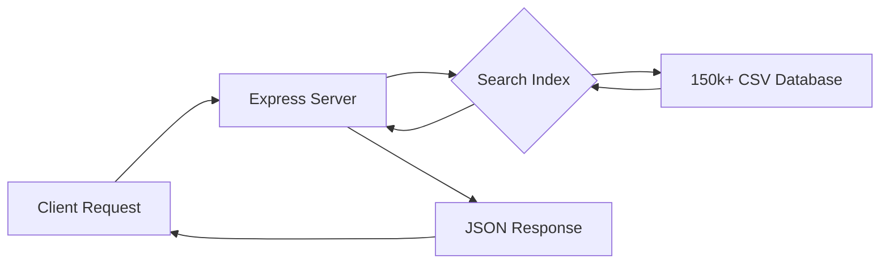

# 🏎️ AutoVision: Axis DriveWorks

**The Ultimate Interactive 3D Automotive Encyclopedia & Configurator**

[](https://react.dev/)
[](https://nodejs.org/)
[](https://threejs.org/)
[](https://render.com/)

AutoVision (Axis DriveWorks) is a high-performance, full-stack automotive platform designed to bridge the gap between massive data management and high-fidelity 3D visualization. It features a curated database of over 150,000 vehicles, coupled with a real-time 3D configurator for interactive engineering demonstrations.

---

## 🌟 Key Features

- **High-Fidelity 3D Showroom:** Interactive 3D car rendering with real-time material manipulation, physics-based lighting, and environment mapping.
- **Dynamic 3D Configurator:** Advanced "Exploded View" mechanics, paint finish transitions (Gloss, Matte, Metallic), and wheel swapping.
- **Massive Data Engine:** Ultra-fast search and filtering across 150k+ vehicle records using an optimized Node.js indexing system.
- **Cinematic Visual Hub:** Automated image retrieval using multi-stage fallback logic and high-resolution automotive photography via API integration.
- **Responsive Engineering:** A sleek, glassmorphic UI built with pure CSS, ensuring a premium experience across mobile, tablet, and desktop devices.

---

## 🛠️ Technology Stack

### **Frontend (The Visual Core)**
- **Framework:** React 19 (Vite)
- **3D Engine:** Three.js, React Three Fiber (R3F)
- **Utilities:** `@react-three/drei` for optimized controls, shaders, and loaders.
- **Styling:** Vanilla CSS (Custom Design System) using modern Flexbox and Grid layouts.
- **State Management:** React Hooks (Context API for global configuration).
- **Navigation:** React Router 7.

### **Backend (The Data Engine)**
- **Runtime:** Node.js
- **Framework:** Express.js
- **Data Architecture:** In-memory CSV indexing for O(1) search performance on massive datasets.
- **Middleware:** CORS (Cross-Origin Resource Sharing), Security Headers (Helmet), and Request Logging.
- **Deployment:** Render (Web Service).

---

## 📐 System Architecture

### 1. The 3D Rendering Pipeline
The application uses a modular 3D pipeline where models are loaded dynamically from a remote registry. 
- **Draco Compression:** GLTF models are compressed for web delivery.
- **Material Mapping:** A proprietary JSON manifest maps vehicle components (body, rims, glass) to high-quality Three.js materials.
- **State Sync:** Changes in the UI (color pickers, toggles) are propagated through a global state to update Three.js textures in real-time.

### 2. Backend Data Flow


### 3. Visual Content Pipeline
To ensure 100% visual uptime, the frontend implements a fallback chain:
`Custom GLB Model` ➔ `High-Res API Image` ➔ `Smart Placeholder` ➔ `Brand Logo`.

---

## 🚀 Getting Started

### 1. Repository Structure
```
/
├── axisdriveworks/         # Frontend React Application
└── axisdriveworks-backend/ # Express.js Search API
```

### 2. Installation
**Frontend:**
```bash
cd axisdriveworks
npm install
npm run dev
```

**Backend:**
```bash
cd axisdriveworks-backend
npm install
node server.js
```

### 3. Environment Setup
Create a `.env` file in the `axisdriveworks` folder:
```env
VITE_API_URL=https://your-backend-url.onrender.com
VITE_UNSPLASH_ACCESS_KEY=your_key
```

---

## 📈 Performance & Optimization
- **Asset Management:** Lazy-loading of 3D models and progressive image loading.
- **Memory Management:** Efficient disposal of Three.js geometries and textures to prevent memory leaks during long customization sessions.
- **Network:** Gzip compression and optimized CORS pre-flight handling.

---

## 👨‍💻 Engineering Insights (Recruiter Note)
This project serves as a showcase for production-grade software engineering:
- **Complex UI/UX:** Managing deep 3D interactions alongside traditional web forms.
- **Full-Stack Proficiency:** Bridging a high-concurrency frontend with a data-heavy backend.
- **Scalability:** The architecture is designed to handle thousands of models with minimal configuration changes.

---

© 2025 Axis DriveWorks. Developed by Adarsh Saripaka.
