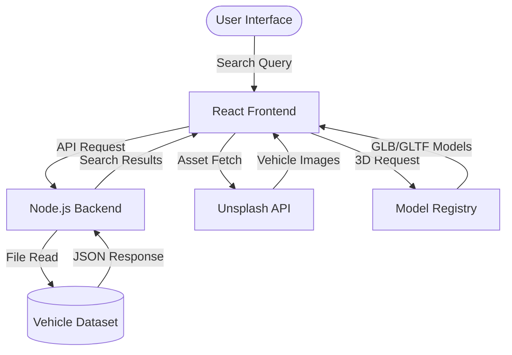
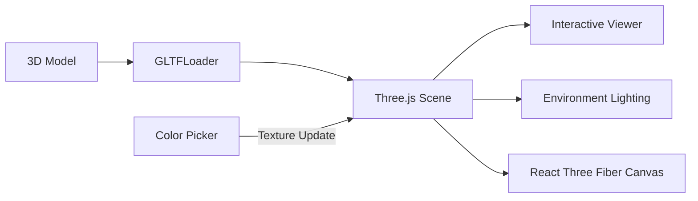

# Axis DriveWorks

An Interactive 3D Car Configurator and Vehicle Search Platform

---

## Project Overview

Axis DriveWorks is a full-stack 3D car configurator and vehicle search platform. It allows users to search cars from a vehicle database, view vehicle details, load dynamic car images, and interact with 3D car models in the browser. The platform demonstrates the integration of large datasets with real-time 3D rendering, providing a clean and responsive interface for automotive exploration.

---

## System Architecture

The following diagram illustrates the data flow and communication between the frontend, backend, and external APIs.



---

## 3D Rendering Pipeline

The 3D viewer utilizes a modular pipeline to ensure performance and interactive stability.



---

## Core Features

- Vehicle search powered by a dedicated backend API.
- Integration of a comprehensive vehicle dataset stored in CSV format.
- Interactive 3D car viewer for real-time model interaction.
- Dynamic paint color customization for 3D models.
- Dynamic vehicle imagery retrieval via the Unsplash API.
- Fully responsive frontend interface built for multiple devices.
- Decoupled frontend and backend architecture for better maintainability.
- Pre-configured for seamless deployment on Render.

---

## Tech Stack

### Frontend

| Technology | Purpose |
|---|---|
| React 19 | Building the user interface using functional components and hooks |
| Vite | Fast development server and optimized production build |
| Vanilla CSS | Custom responsive styling and layout design |

### 3D Rendering

| Technology | Purpose |
|---|---|
| Three.js | Rendering and managing 3D car models in the browser |
| React Three Fiber | React-based renderer for Three.js scenes |
| GLB/GLTF Models | Loading interactive 3D vehicle models |

### Backend

| Technology | Purpose |
|---|---|
| Node.js | JavaScript runtime for backend execution |
| Express.js | Creating REST API endpoints and handling server-side logic |
| CORS | Enabling frontend-backend communication across different origins |

### Data and API Integration

| Technology | Purpose |
|---|---|
| CSV Dataset | Storing and reading vehicle information |
| Unsplash API | Fetching dynamic high-resolution vehicle images |

### Deployment

| Technology | Purpose |
|---|---|
| Render | Hosting and deployment configuration for the application |

---

## Folder Structure

```bash
axis-driveworks/
├── axisdriveworks/              # Frontend React Application
│   ├── public/                  # Static assets
│   │   ├── Logo.png             # Application logo
│   │   └── cardata.csv          # Vehicle database (fallback)
│   ├── src/
│   │   ├── Api/                 # API service logic
│   │   │   └── FetchApi.js      # Backend communication logic
│   │   ├── images/              # UI assets
│   │   │   ├── car1.png
│   │   │   ├── car2.png
│   │   │   └── car3.png
│   │   ├── sections/            # Modular UI components
│   │   │   ├── BrandCard.css / BrandCard.jsx
│   │   │   ├── BrandPage.css / BrandPage.jsx
│   │   │   ├── Footer.css / Footer.jsx
│   │   │   ├── Hero.css / Hero.jsx
│   │   │   ├── Search.css / Search.jsx
│   │   │   ├── Showcase.css / Showcase.jsx
│   │   │   └── VehicleCard.css / VehicleCard.jsx
│   │   ├── viewer/              # 3D viewer components
│   │   ├── App.css / App.jsx    # Root component
│   │   ├── index.css            # Global styling
│   │   └── main.jsx             # Application entry point
│   ├── package.json             # Frontend dependencies
│   └── vite.config.js           # Vite configuration
│
├── axisdriveworks-backend/      # Node.js Express Backend
│   ├── data/
│   │   ├── axisdriveworks-3d-assets/ # 3D model registry
│   │   └── cardata.csv          # Vehicle search database
│   ├── server.js                # Main API server
│   └── package.json             # Backend dependencies
│
└── README.md                    # Project Documentation
```

---

## Environment Variables

### Frontend (.env)
```env
VITE_API_URL=http://localhost:3000
VITE_UNSPLASH_ACCESS_KEY=your_unsplash_access_key
```

### Backend (.env)
```env
PORT=3000
FRONTEND_URL=http://localhost:5173
```

---

## Installation and Setup

### 1. Backend Setup
1. Navigate to the backend directory: `cd axisdriveworks-backend`
2. Install dependencies: `npm install`
3. Configure the environment variables in a `.env` file.
4. Start the server: `node server.js`

### 2. Frontend Setup
1. Navigate to the frontend directory: `cd axisdriveworks`
2. Install dependencies: `npm install`
3. Configure the environment variables in a `.env` file.
4. Start the development server: `npm run dev`

---

## Usage

1. Launch the application in your browser (defaults to localhost:5173).
2. Use the search bar to find specific car models or brands.
3. Click on a vehicle from the search results to view its 3D model.
4. Use the provided color palette to change the vehicle's paint finish.

---

## Project Status

The project is currently functional and serves as a portfolio demonstration for full-stack 3D integration. It is fully configured for production deployment on Render.

---

## Future Improvements

- Implementation of physics-based rendering (PBR) for higher material fidelity.
- User account system to save and manage customized vehicle configurations.
- Expansion of the backend API to support advanced filtering and technical data.
- Integration of a persistent database (e.g., MongoDB or PostgreSQL) to replace CSV storage.

---

## Author

Adarsh Saripaka
